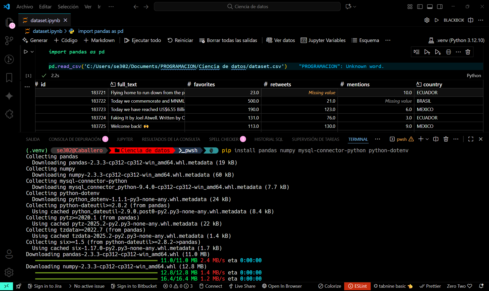

1 Creacion del entorno virtual 

1.1 Activacion de entorno virtual

"C:/Users/se302/Documents/PROGRAMACION/Ciencia de datos/.venv/Scripts/Activate.ps1" 

1.2. Instalación de Librerías

Instale todas las librerías externas que requerirá el proyecto. 

# Ejecutar en la terminal con (.venv) activo
pip install pandas numpy mysql-connector-python python-dotenv

1.3 . Cargar Archivo dataset.csv para el ejercicio

1.4 Crear un archivo dataset.ipynb 
Su documentacion:https://jupyter.org/

1.5 Intentar seguir la Documentacion:https://www.conventionalcommits.org/en/v1.0.0/